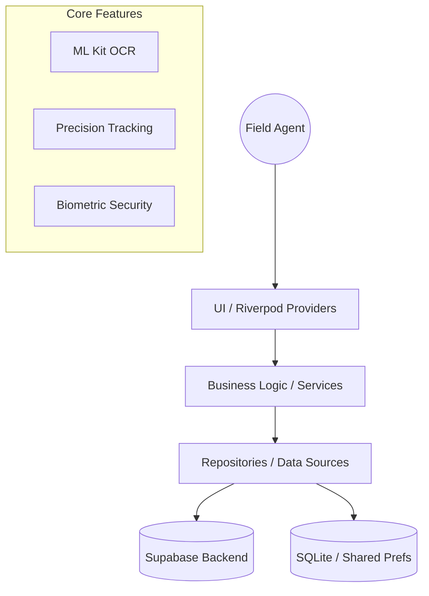

# 🏛️ Architecture & Engineering Manifesto - Nour Mobile

## Vision
Nour Mobile is a judicial field agent application designed for the Moroccan bailiff corps. It prioritizes offline-first reliability, high-security media capture, and real-time synchronization.

## Clean Architecture Implementation
We use a feature-based architecture to ensure scalability and maintainability:

### Key Architectural Layers
- **Presentation Layer**: Powered by Riverpod 3.0 Notifiers. UI is strictly declarative.
- **Domain Layer**: Contains use cases and business entities.
- **Data Layer**: Handles data fetching, mapping, and local persistence.

## Engineering Standards
1. **Zero-Trust Principles**: All media is hashed and timestamped on-device.
2. **Quality Gate**: Every commit is verified by GitHub Actions.
3. **Documentation**: Code is documented following Dart best practices.
